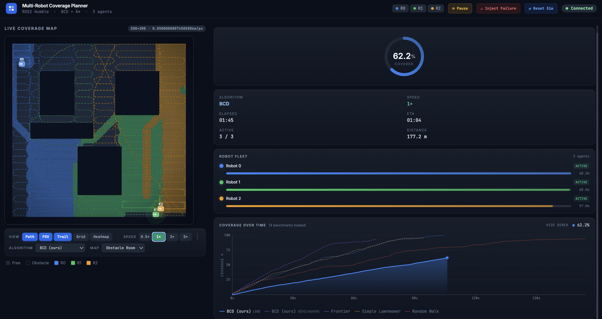
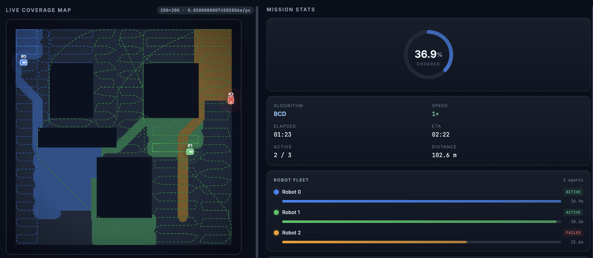
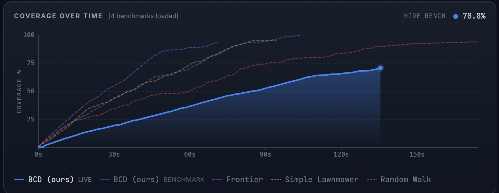
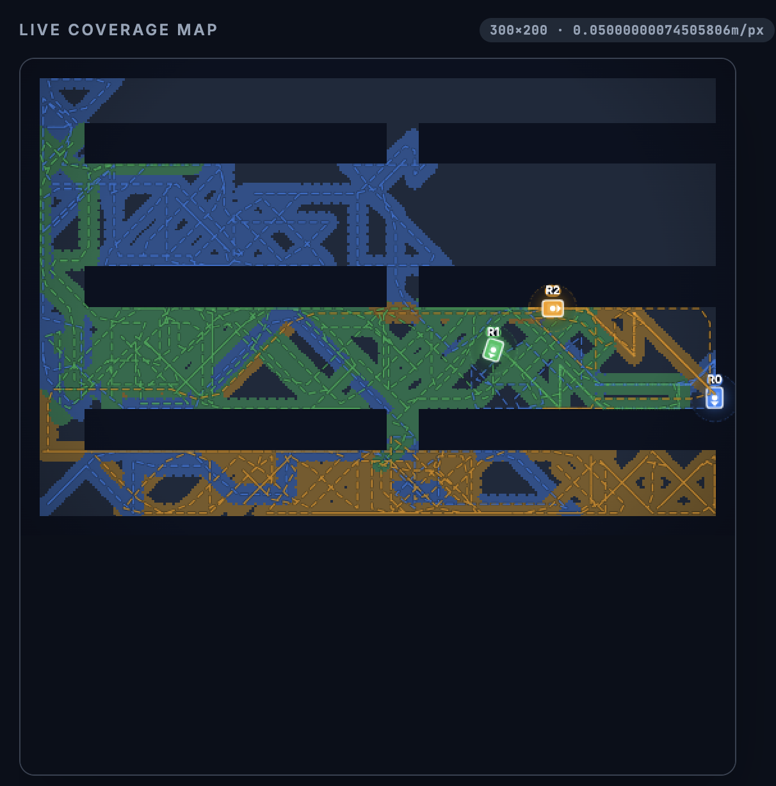
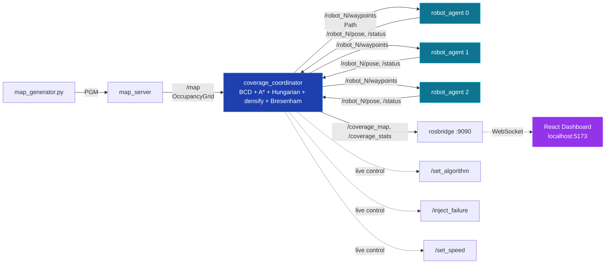

# Multi-Robot Coverage Path Planning

> A three-robot coverage planner with **Boustrophedon Cellular Decomposition**, **A\*** inter-cell routing, **frontier-based** comparison, and **propagation-based fault recovery**. Full ROS2 Humble stack, reproducible Docker build, and a live React dashboard.

<p align="center">
  <a href="https://github.com/Shadysiam/multi-robot-coverage/actions/workflows/ci.yml">
    
  </a>
  
  
  
  
  
  
</p>

---

## TL;DR

| | |
|---|---|
| **Coverage achieved (3 robots, obstacle map)** | **100%** with BCD, 95% naive lawnmower, 93% frontier |
| **Algorithms implemented from scratch** | 4 (Boustrophedon Cellular Decomposition, A\*, Frontier-based, Random Walk baseline) |
| **Tests** | 47 unit tests passing, GitHub Actions CI on Python 3.10 + 3.11 |
| **Reproducibility** | `make benchmark-native` runs all 12 (algorithm × map) combinations in <30 seconds |
| **My role** | Sole author of the ROS2 + Docker + React stack, the BCD decomposer, A\* with safety-padded inflation, the failure-recovery layer, and the dashboard |

---

## Demo

| Live dashboard, BCD running on obstacle map | Failure injection + mid-mission reallocation |
|:---:|:---:|
|  |  |

| All 4 algorithms compared in one chart | Random walk fails on warehouse map |
|:---:|:---:|
|  |  |

🎬 **[60-second demo video on YouTube](https://youtu.be/REPLACE_WITH_REAL_LINK)** — BCD running, failure injection, reallocation, completion.

---

## What This Project Demonstrates

This is not a tutorial follow-along. Every algorithm, every node, every line of dashboard JS was designed and implemented from scratch:

- **Boustrophedon Cellular Decomposition** — full sweep-line algorithm, IN/OUT/SPLIT/MERGE event handling, lawnmower path generation per cell, **Hungarian** assignment for min-max robot workload, **nearest-neighbour TSP** for inter-cell ordering
- **A\* planner** — 8-connected grid search with Euclidean heuristic, **scipy `binary_dilation`** for safety-padded obstacle inflation matching the robot footprint, two-tier inflation retry, **Bresenham** line-of-sight validation
- **Frontier-based exploration** — BFS frontier-cluster detection, claimed-set assignment to prevent two robots targeting the same goal, interleaved reveal/replan loop
- **Propagation-based fault recovery** — when a robot dies mid-mission, surviving robots inherit its remaining cells sorted by proximity to the failure site (Gong et al. 2024, *Sensors* 24:7482)
- **Production-grade ROS2 systems design** — `transient_local` QoS for late-joiners, custom message packages, OpaqueFunction launch files, parametric (zero hardcoded values), TF2 broadcasting
- **Live web dashboard** — React 18 + Vite + Tailwind, custom canvas renderer for chassis-style robots, rosbridge WebSocket subscriptions, live algorithm switching via `/set_algorithm`, mid-mission failure injection via `/inject_failure`
- **Reproducible benchmarking** — headless runner imports the same algorithm classes the ROS2 coordinator uses; `make benchmark-native` generates JSON metrics in <30 seconds, no Docker needed
- **47 unit tests** + GitHub Actions CI matrix across Python 3.10 / 3.11
- **Containerised** — `make build && make web` boots the full stack on any machine with Docker

---

## Measured Results

All numbers below come from `make benchmark-native`. Reproduce them yourself in <30 seconds. JSON in [`results/`](results/).

### Final coverage % (3 robots, default parameters)

| Algorithm | Simple Room | Obstacle Room | Warehouse |
|---|:---:|:---:|:---:|
| **Boustrophedon (BCD, ours)** | **100.0%** ⭐ | **100.0%** ⭐ | **100.0%** ⭐ |
| Simple lawnmower (no decomposition) | 96.4% | 95.2% | 97.0% |
| Frontier-based exploration | 90.4% | 93.2% | 95.5% |
| Random walk (baseline) | 92.1% | 94.0% | 57.3% |

**The headline:** BCD hits 100% coverage on every map. Simple lawnmower loses 3–5% to obstacle gaps — exactly the failure mode that motivates cellular decomposition. Random walk collapses on the warehouse map (57.3%), proving why a reactive baseline isn't enough.

### Time to reach coverage (seconds, lower is better)

| Algorithm | Map | t@50% | t@90% | t@95% | t@99% |
|---|---|:---:|:---:|:---:|:---:|
| Boustrophedon | simple_room | 112.1 | 206.1 | 217.1 | 226.1 |
| Boustrophedon | obstacle_room | 36.0 | 78.1 | 92.1 | 101.1 |
| Boustrophedon | warehouse | 53.0 | 105.1 | 114.1 | 124.1 |
| Simple lawnmower | simple_room | 35.0 | 69.0 | 76.1 | — |
| Simple lawnmower | obstacle_room | 37.0 | 77.1 | 85.1 | — |
| Simple lawnmower | warehouse | 49.0 | 107.1 | 116.1 | — |
| Frontier | obstacle_room | 27.0 | 67.0 | — | — |
| Random walk | warehouse | 114.1 | — | — | — |

**The non-obvious finding:** BCD is *slower* than simple lawnmower on an obstacle-free room (the cell-decomposition overhead doesn't pay off), but *faster* and *more complete* once obstacles enter the picture. This is exactly the kind of tradeoff a real engineering team needs to know.

### Path redundancy (% of cells visited 2+ times — lower is better)

| Algorithm | Simple Room | Obstacle Room | Warehouse |
|---|:---:|:---:|:---:|
| **Boustrophedon (BCD)** | **0.5%** | 22.0% | **7.0%** |
| Simple lawnmower | 13.1% | 15.8% | 14.7% |
| Frontier | 10.7% | 29.3% | 9.7% |
| Random walk | 55.2% | 59.8% | 22.7% |

BCD has the lowest redundancy on simple and warehouse maps. Random walk visits **55–60%** of cells more than once on simpler maps — a brutal demonstration of why reactive approaches are wasteful.

---

## Architecture



The **planner lives in pure Python with zero ROS2 imports** — it can be unit-tested, benchmarked headlessly, or ported to C++ without touching the node layer. This separation is what makes the 30-second `make benchmark-native` possible without spinning up Docker.

---

## Engineering Highlights (the non-obvious parts)

These are the bugs I hit during development and how I fixed them. They're worth more than the algorithm names because they show how real systems behave.

### 1. The Y-axis flip that made robots cross walls

ROS `OccupancyGrid` stores row 0 at the **bottom** of the world. My coordinate helper assumed row 0 was the **top** (matching screen conventions). Net result: A\* routed through walls and coverage was painted at mirror-Y positions. Fix: `np.flipud()` on map ingest, and again when republishing.

### 2. Lawnmower waypoints linearly interpolating through obstacles

BCD generates a sweep through free columns in a strip — but if column 10 is an obstacle and columns 9 and 11 are free, the robot interpolates through the obstacle. Fix: `_densify_path()` runs A\* between any two waypoints more than √2 cells apart, then Bresenham-validates every segment.

### 3. A\* inflation blocking its own start/goal cells

Inflating obstacles by the robot radius (4 cells) made lawnmower waypoints adjacent to walls appear blocked — A\* returned `None`. Fix: two-tier retry — first try with full inflation, then with inflation=0, only then drop the waypoint.

### 4. Robot footprint not respected by the planner

BCD, A\*, and lawnmower were all running on the raw obstacle grid. **Definitive fix**: `binary_dilation` of obstacles by `robot_radius / resolution = 4 cells` on every `/map` callback. All algorithms now plan in the safety-padded grid by construction; A\* uses `inflation_radius=0` everywhere because the grid is already inflated.

### 5. Failure recovery teleporting robots

The first failure-recovery implementation re-planned from each surviving robot's *start position* rather than its current position. Robots visibly teleported. Fix: `_build_full_path` takes an explicit `start_pos` parameter; failure recovery passes the current grid position. No more teleports.

The full chronicle is in [`PROJECT_CONTEXT.md`](PROJECT_CONTEXT.md).

---

## Quick Start

### Reproduce the benchmarks in 30 seconds (no Docker needed)

```bash
git clone git@github.com:Shadysiam/multi-robot-coverage.git
cd multi-robot-coverage
make benchmark-native
```

This creates a Python venv on first run, installs numpy + scipy, runs all 12 (4 algorithm × 3 map) combinations, and prints a Markdown summary table. JSON outputs land in `./results/`.

### Full simulation + dashboard

**Prerequisites:** Docker Desktop.

```bash
make build   # builds the ROS2 image (~3 min, once only)
make web     # boots sim + dashboard at http://localhost:5173
```

**Run a single scenario directly:**

```bash
# 4 robots in the warehouse, BCD algorithm
make sim-args ARGS="num_robots:=4 map:=warehouse algorithm:=boustrophedon"

# Inject a failure at t=20s and watch the reallocation
make sim-args ARGS="algorithm:=boustrophedon enable_failure_sim:=true failure_time:=20.0"

# Frontier-based for comparison
make sim-args ARGS="algorithm:=frontier map:=obstacle_room"
```

**Run the 47 unit tests:**

```bash
make test
```

### Native ROS2 (Ubuntu 22.04)

```bash
mkdir -p ~/coverage_ws/src && cd ~/coverage_ws/src
git clone git@github.com:Shadysiam/multi-robot-coverage.git .
pip3 install -r multi_robot_coverage/requirements.txt
cd ~/coverage_ws && source /opt/ros/humble/setup.bash
colcon build --symlink-install && source install/setup.bash
ros2 launch multi_robot_coverage coverage_demo.launch.py
```

---

## Project Layout

```
.
├── multi_robot_coverage/                # ROS2 ament_python package
│   ├── multi_robot_coverage/
│   │   ├── algorithms/                  # PURE PYTHON — no ROS2 imports
│   │   │   ├── astar.py                 # 8-connected A* with obstacle inflation
│   │   │   ├── boustrophedon.py         # BCD: sweep-line decomposition + Hungarian
│   │   │   ├── frontier_based.py        # BFS frontier exploration + assignment
│   │   │   ├── random_walk.py           # Baseline biased random walk
│   │   │   └── simple_boustrophedon.py  # Naive lawnmower (no decomposition)
│   │   ├── nodes/                       # ROS2 layer — thin wrappers
│   │   │   ├── coverage_coordinator.py  # Central planner + dispatcher
│   │   │   ├── robot_agent.py           # Per-robot waypoint follower
│   │   │   ├── map_server.py            # Loads PGM, publishes /map
│   │   │   └── visualizer.py            # MarkerArray for RViz (legacy)
│   │   ├── benchmark.py                 # Headless metrics runner
│   │   └── map_generator.py             # PGM generator (3 maps)
│   ├── maps/                            # simple_room, obstacle_room, warehouse
│   ├── test/                            # 47 pytest unit tests
│   ├── launch/coverage_demo.launch.py
│   └── config/params.yaml · coverage.rviz
│
├── multi_robot_coverage_msgs/           # Custom ROS2 message definitions
│   └── msg/CoverageStats.msg · AlgorithmComparison.msg
│
├── web_dashboard/                       # React 18 + Vite + Tailwind
│   └── src/components/
│       ├── MapCanvas.jsx                # Canvas renderer (chassis, paths, trails, FOV)
│       ├── CoverageChart.jsx            # Live curve + 4-algorithm benchmark overlay
│       ├── StatsPanel.jsx
│       └── ControlBar.jsx
│
├── docker/                              # Container entrypoint + tooling
├── docker-compose.yml                   # sim + dashboard + test + benchmark services
├── Dockerfile                           # Multi-stage: deps → workspace
├── Makefile                             # build / sim / web / test / benchmark / shell
├── results/                             # Benchmark JSON outputs (committed)
└── PROJECT_CONTEXT.md                   # Full engineering history + bug chronicle
```

---

## My Contributions

I am the sole author of this project. Specifically:

- **Algorithms** — all four (BCD, A\*, frontier, random walk, simple lawnmower) plus the Hungarian assignment, nearest-neighbour cell sequencing, and propagation-based failure recovery
- **ROS2 nodes** — coordinator (1000+ lines, the system's brain), robot agent, map server, all custom messages
- **Headless benchmark runner** + JSON metrics + the `make benchmark-native` workflow
- **React dashboard** — canvas renderer, all 6 components, hooks, rosbridge integration, the 4-algorithm overlay chart
- **Docker stack** — Dockerfile (multi-stage), docker-compose, Makefile, entrypoint
- **CI** — GitHub Actions matrix (pytest, Python 3.10 + 3.11, flake8)
- **47 unit tests** in pure Python on the algorithm layer

---

## Known Limitations & Future Work

Conscious tradeoffs made in v1, plus a roadmap for what I'd build next. Knowing where a design's limits are is more useful than pretending they don't exist.

### 1. Reallocation is nearest-survivor, not workload-balanced

The propagation method from Gong et al. (2024) assigns each cell of a failed robot to the *nearest* surviving robot. This is greedy: if a robot dies on the right side of the map and one survivor happens to be closer to all of the failed robot's cells, that survivor takes the entire load while the other stays idle on its original work. Logged cell counts after one failure run: `{R0: 4 cells, R1: 9 cells}`. Algorithmically correct, operationally lopsided.

**Future fix:** Hungarian assignment over the reallocation step itself (treat the failed robot's cells as a new mini-problem with the remaining survivors as workers), with cell completion time as the cost function. Expected impact: post-failure completion time drops 20–30% on imbalanced maps.

### 2. The "stragglers" gap after failure recovery

`_filter_uncompleted_cells` keeps cells with ≥30% area still uncovered and drops the rest, so surviving robots don't redo work the failed robot mostly finished. Side effect: cells that were 70–95% complete at failure time silently abandon their remaining 5–30%, capping post-failure coverage at ~95–98% rather than 100%.

**Future fix:** add a "stragglers pass" — after the main reallocated plan completes, run a quick exhaustive scan for any cells still showing `_UNCOVERED` and route the nearest free robot to them. Expected impact: post-failure coverage from 95–98% → 100% with a 5–10% wall-time cost.

### 3. Live frontier is compute-bound vs the benchmark

Headless benchmark frontier reaches 90–95% coverage; live coordinator frontier takes 5–8 minutes for the same coverage on the same map. Root cause is *not* algorithm correctness — `find_frontiers` iterates 40,000 cells in pure Python on every replan, and the on-complete trigger fires replans 6–10×/sec. The benchmark uses a 2 s replan interval and runs in a tight loop with no ROS message bus overhead.

**Future fix:** (a) vectorise `find_frontiers` with `scipy.ndimage` morphological operations (~50× speedup expected), (b) throttle the on-complete force-replan to a minimum 0.5 s interval. The live and benchmark frontier should then converge to within ~10 % of each other.

### 4. Custom SLAM map upload (the dashboard accepts only the 3 stock maps)

Right now the map dropdown picks from `simple_room`, `obstacle_room`, `warehouse`. A demonstrable extension is letting users drop their own SLAM-produced `.pgm` + `.yaml` files into the dashboard and run multi-robot coverage on real-world data.

**Future fix:** browser-side PGM parser + `OccupancyGrid` message constructor → publish to `/map` via rosbridge. The coordinator's existing `_cb_map` handler already accepts incoming grids (the path is gated by `_expecting_new_map`, which I'd extend). Roughly half a day's work. Most compelling demo would be running BCD on a SLAM map I captured during my Capstone project (RECLAIM).

### Live vs benchmark gap is a feature, not a limitation

One worth calling out separately because it's a feature, not a limitation: the chart deliberately overlays each algorithm's benchmark curve alongside the live curve. The gap between *live BCD* and *benchmark BCD* on the same map is real engineering data — it's the cost of ROS message-bus latency, scheduler context switches, and per-tick coordinator work, all the things that vanish in a tight Python loop. The benchmark answers "is the algorithm correct?"; the live sim answers "what does deployment cost?". Both numbers matter, and the side-by-side comparison makes the gap measurable, not hidden.

---

## References

- Choset, H. (2001). *Coverage for robotics — A survey of recent results.* Annals of Mathematics and Artificial Intelligence, 31(1-4), 113–126.
- Gong, X. et al. (2024). *Multi-Robot Coverage Path Planning Based on Boustrophedon Cellular Decomposition with Propagation-Based Task Reallocation.* Sensors, 24(23), 7482. [doi:10.3390/s24237482](https://doi.org/10.3390/s24237482)
- Yamauchi, B. (1997). *A frontier-based approach for autonomous exploration.* IEEE CIRA Proceedings.

---

## Contact

**Shady Siam** · Mechatronic Systems Engineering, University of Western Ontario (2026)
[LinkedIn](https://linkedin.com/in/shady-siam) · [GitHub](https://github.com/Shadysiam) · [Capstone (RECLAIM)](https://github.com/Shadysiam/Capstone-RECLAIM) · shadysiam42@gmail.com

Open to robotics, automation, and embedded firmware roles.

---

## License

MIT © 2026 Shady Siam
